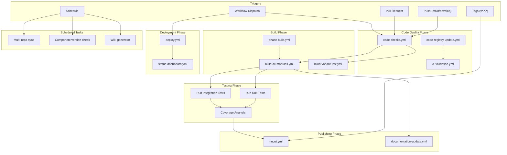

# GitHub Actions Workflow Architecture - HELIOS Platform

## Overview

This document provides a comprehensive overview of the GitHub Actions workflow system for the HELIOS Platform. The workflow architecture is designed to support continuous integration, deployment, testing, and publishing across multiple platforms and frameworks.

**Version**: 1.0  
**Last Updated**: 2024  
**Maintainer**: HELIOS Platform Team

---

## Table of Contents

1. [Workflow Architecture Diagram](#workflow-architecture-diagram)
2. [Trigger Conditions](#trigger-conditions)
3. [Workflow Execution Flow](#workflow-execution-flow)
4. [Job Dependencies](#job-dependencies)
5. [Workflow Matrix Strategy](#workflow-matrix-strategy)
6. [Conditional Logic](#conditional-logic)
7. [Status Reporting](#status-reporting)
8. [Artifact Management](#artifact-management)
9. [Security Considerations](#security-considerations)
10. [Performance Characteristics](#performance-characteristics)

---

## Workflow Architecture Diagram



### Workflow Execution Timeline

```
┌─────────────────────────────────────────────────────────────────┐
│                      PUSH/PR EVENT                              │
└────────────┬────────────────────────────────────────────────────┘
             │
             ├──────► CODE QUALITY CHECKS (3-5 min)
             │        ├─ Syntax Validation
             │        ├─ Security Scanning
             │        ├─ Registry Check
             │        ├─ Path Validation
             │        └─ Documentation Check
             │
             ├──────► BUILD PHASE (10-15 min) ◄─── Parallel with quality
             │        ├─ [ubuntu-latest] ✓
             │        ├─ [windows-latest] ✓
             │        └─ [Module matrix] (core, modules, registry, cli, ui)
             │
             ├──────► TESTING PHASE (8-12 min)
             │        ├─ Unit Tests
             │        ├─ Integration Tests
             │        └─ Coverage Reports
             │
             └──────► Publishing (on Tags)
                      ├─ NuGet Package Creation
                      ├─ NuGet.org Publishing
                      └─ GitHub Release
```

---

## Trigger Conditions

### 1. Push Trigger
```yaml
on:
  push:
    branches:
      - main           # Production branch
      - develop        # Development branch
      - 'feature/**'   # Feature branches
    paths-ignore:
      - 'docs/**'      # Skip documentation changes
      - '**.md'        # Skip markdown files
    tags:
      - 'v*.*.*'       # Semantic versioning tags
```

**Behavior**:
- Triggers on commits to main, develop, and feature branches
- Ignores documentation-only changes
- Triggers release workflow on version tags

### 2. Pull Request Trigger
```yaml
on:
  pull_request:
    branches:
      - main
      - develop
    paths-ignore:
      - 'docs/**'
      - '**.md'
```

**Behavior**:
- Runs quality checks on PR submissions
- Prevents merge until checks pass
- Reports results as PR comments

### 3. Workflow Dispatch
```yaml
on:
  workflow_dispatch:
    inputs:
      clean_build:
        description: 'Clean build (no cache)'
        required: false
        default: 'false'
```

**Behavior**:
- Manual trigger from GitHub UI
- Allows optional parameters
- Useful for on-demand builds

### 4. Schedule Trigger
```yaml
on:
  schedule:
    - cron: '0 2 * * *'     # Daily at 2 AM UTC
    - cron: '0 3 * * 0'     # Weekly (Sunday at 3 AM UTC)
    - cron: '0 4 1 * *'     # Monthly (1st at 4 AM UTC)
```

**Behavior**:
- Automated scheduled tasks
- Can trigger maintenance workflows
- Useful for periodic verification

---

## Workflow Execution Flow

### Standard PR/Push Flow

```
1. CODE QUALITY CHECKS (Gate 1)
   ├─ Syntax Validation
   ├─ Security Scanning
   ├─ Registry Validation
   ├─ Path Validation
   └─ Documentation Check
   └─ FAIL ──► Stop (Comment on PR)

2. BUILD ALL MODULES (Gate 2) - Parallel
   ├─ [Module: core]     ─► Lint ─► Build ─► Test ─► Coverage
   ├─ [Module: modules]  ─► Lint ─► Build ─► Test ─► Coverage
   ├─ [Module: registry] ─► Lint ─► Build ─► Test ─► Coverage
   ├─ [Module: cli]      ─► Lint ─► Build ─► Test ─► Coverage
   └─ [Module: ui]       ─► Lint ─► Build ─► Test ─► Coverage
   └─ FAIL ──► Stop (Comment on PR)

3. VERIFY BUILD INTEGRITY (Gate 3)
   ├─ Download all artifacts
   ├─ Verify artifact count
   └─ Generate build report

4. REPORT STATUS
   ├─ Generate summary
   ├─ Comment on PR (if applicable)
   └─ Update status checks
```

### Release/Tag Flow

```
1. CODE QUALITY CHECKS (Same as above)
2. BUILD ALL MODULES (Same as above)
3. CREATE NUGET PACKAGE
   ├─ Get version from .csproj
   ├─ Pack assemblies
   └─ Upload package artifact
4. PUBLISH TO NUGET.ORG
   ├─ Download package artifact
   ├─ Push to NuGet registry
   ├─ Skip if duplicate version
   └─ Create GitHub Release
5. PUBLISH TO GITHUB PACKAGES
   ├─ Configure package source
   ├─ Push to GitHub registry
   └─ Skip if duplicate
```

---

## Job Dependencies

### Dependency Graph

```yaml
code-checks
    ↓
build-all-modules (setup → build → verify)
    ↓
Testing Phase (Unit → Integration → Coverage)
    ↓
[On Tags] nuget (build → package → publish)
    ↓
documentation-update
    ↓
status-dashboard
```

### Critical Path

The critical path (longest chain) is:
1. Code Checks: ~5 min
2. Build Setup: ~2 min
3. Build Modules (parallel): ~10 min
4. Build Verification: ~2 min
5. Testing: ~10 min
6. **Total: ~29 minutes for standard CI flow**

---

## Workflow Matrix Strategy

### Multi-Platform Matrix

```yaml
strategy:
  matrix:
    os:
      - ubuntu-latest      # Linux
      - windows-latest     # Windows
      - macos-latest       # macOS (if applicable)
    dotnet-version:
      - '8.0'
      - '7.0'
      - '6.0'
    architecture:
      - x64
      - x86                # Windows only
  fail-fast: false         # Complete all jobs even if one fails
```

**Total Combinations**: 2 OS × 3 .NET versions = 6 concurrent jobs

### Module Matrix

```yaml
strategy:
  matrix:
    module:
      - core
      - modules
      - registry
      - cli
      - ui
  fail-fast: false
```

**Total Combinations**: 5 modules (sequential or parallel)

---

## Conditional Logic

### Environment-Based Conditions

```yaml
# Only run on specific branches
if: github.ref == 'refs/heads/main'

# Only run on PR events
if: github.event_name == 'pull_request'

# Only run on tag pushes (releases)
if: startsWith(github.ref, 'refs/tags/v')

# Only run if previous job succeeded
if: success()

# Run even if previous job failed
if: always()

# Run if artifact exists
if: hashFiles('artifacts/*.nupkg') != ''
```

### Version-Based Conditions

```yaml
# Only publish pre-release versions
if: contains(github.ref_name, 'alpha') || 
    contains(github.ref_name, 'beta') || 
    contains(github.ref_name, 'rc')

# Only publish stable versions
if: !contains(github.ref_name, 'alpha') && 
    !contains(github.ref_name, 'beta') && 
    !contains(github.ref_name, 'rc')
```

---

## Status Reporting

### Badge Integration

```markdown
[](https://github.com/YOUR_ORG/helios-platform/actions/workflows/build-all-modules.yml)

[](https://github.com/YOUR_ORG/helios-platform/actions/workflows/code-checks.yml)

[](https://github.com/YOUR_ORG/helios-platform/actions/workflows/nuget.yml)

[](https://github.com/YOUR_ORG/helios-platform/actions/workflows/deploy.yml)
```

### Status Check Rules

Enable branch protection with required status checks:
- ✅ Code Checks - HELIOS Platform v2
- ✅ Build All Modules
- ✅ Test Suite
- ✅ Code Coverage (if configured)

### Slack/Email Notifications

**Configure in GitHub Settings**:
1. Settings → Notifications
2. Enable "Notify me" for workflow runs
3. Configure email delivery

**Custom Notifications**:
```yaml
- name: Notify on Failure
  if: failure()
  uses: 8398a7/action-slack@v3
  with:
    status: ${{ job.status }}
    text: 'Build failed!'
    webhook_url: ${{ secrets.SLACK_WEBHOOK }}
```

---

## Artifact Management

### Build Artifacts

```yaml
Build Artifacts:
├─ build-artifacts-core/
│  ├─ dist/
│  └─ build/
├─ build-artifacts-modules/
│  ├─ dist/
│  └─ build/
├─ build-artifacts-registry/
│  ├─ dist/
│  └─ build/
├─ build-artifacts-cli/
│  ├─ dist/
│  └─ build/
└─ build-artifacts-ui/
   ├─ dist/
   └─ build/
```

**Retention**: 7 days (configurable)

### Coverage Reports

```yaml
Coverage Artifacts:
├─ coverage-core/
├─ coverage-modules/
├─ coverage-registry/
├─ coverage-cli/
└─ coverage-ui/
```

**Retention**: 7 days

### NuGet Packages

```yaml
NuGet Artifacts:
└─ nuget-package-v1.0.0/
   └─ HELIOS.Platform.1.0.0.nupkg
```

**Retention**: 30 days

### Test Results

```yaml
Test Results:
├─ test-results-windows-latest-8.0/
├─ test-results-windows-latest-7.0/
├─ test-results-windows-latest-6.0/
├─ test-results-ubuntu-latest-8.0/
├─ test-results-ubuntu-latest-7.0/
└─ test-results-ubuntu-latest-6.0/
```

**Retention**: 30 days

---

## Security Considerations

### Secrets Management

**Required Secrets**:
```yaml
NUGET_API_KEY        # NuGet.org publishing key
GITHUB_TOKEN         # Auto-provided by GitHub
AZURE_CREDENTIALS    # Azure deployment credentials
SLACK_WEBHOOK        # Slack notifications (optional)
```

**Best Practices**:
- ✅ Never commit secrets to repository
- ✅ Use GitHub Secrets for sensitive data
- ✅ Rotate secrets regularly
- ✅ Use minimal-permission service principals
- ✅ Restrict secret access to specific workflows

### Permissions

```yaml
permissions:
  contents: read              # Read repository content
  checks: write               # Write status checks
  pull-requests: write        # Comment on PRs
  packages: write             # Publish packages
  id-token: write             # OIDC for Azure
```

### Security Scanning

**Enabled**:
- ✅ Syntax validation
- ✅ Hardcoded secrets detection
- ✅ Registry modification validation
- ✅ Path validation
- ✅ Code coverage enforcement

---

## Performance Characteristics

### Execution Times (Typical)

| Phase | Duration | Notes |
|-------|----------|-------|
| Code Checks | 3-5 min | Parallel steps |
| Build Setup | 1-2 min | Matrix setup |
| Build Modules | 8-12 min | 5 modules parallel |
| Testing | 6-10 min | Unit + Integration |
| Coverage | 2-3 min | Report generation |
| **Total (CI)** | **20-32 min** | Depends on caching |
| Publish NuGet | 5-8 min | Only on tags |
| Deploy | 15-30 min | Environment-dependent |

### Optimization Strategies

1. **Caching**
   - Cache `node_modules` across runs
   - Cache `.dotnet` packages
   - Cache build outputs when safe

2. **Parallelization**
   - Run modules in parallel (5x speedup)
   - Run tests in parallel
   - Use matrix strategy effectively

3. **Skip Rules**
   - Skip CI for documentation changes
   - Skip tests for infrastructure changes
   - Skip builds for config-only changes

4. **Artifact Management**
   - Remove test artifacts after verification
   - Compress large artifacts
   - Set appropriate retention policies

### Cost Estimation

**GitHub Actions Pricing** (as of 2024):
- Free tier: 2,000 minutes/month
- $0.008 per minute for private repos (overages)

**Estimated Monthly Usage**:
- 50 PRs × 20 min = 1,000 min
- 4 releases × 30 min = 120 min
- 30 scheduled tasks × 10 min = 300 min
- **Total: ~1,420 minutes/month** (within free tier)

---

## Troubleshooting Workflow Issues

### Common Problems

1. **Cache Invalidation Issues**
   - Solution: Manual cache clear via Actions tab
   - Or: Add cache-busting query string to key

2. **Matrix Timeout**
   - Solution: Increase timeout or reduce parallelism
   - Check for resource contention

3. **Artifact Upload Failures**
   - Solution: Check file size limits (5GB max)
   - Check retention settings

4. **Dependency Resolution Failures**
   - Solution: Check network connectivity
   - Try `npm ci` instead of `npm install`

### Debug Logging

Enable debug logging:
```yaml
- name: Enable Debug Logging
  run: |
    echo "DEBUG=*" >> $GITHUB_ENV
```

### Workflow Validation

Validate workflow syntax:
```bash
# Using act (local testing)
act push --container-architecture linux/amd64

# Or use GitHub CLI
gh workflow list
gh workflow view build-all-modules.yml
```

---

## Best Practices Summary

✅ **Always**:
- Use consistent naming conventions
- Document workflow purpose and requirements
- Set appropriate timeouts
- Use fail-fast strategically
- Cache dependencies appropriately
- Monitor workflow execution times
- Review and update runner versions regularly

❌ **Never**:
- Hardcode secrets in workflows
- Use `latest` for action versions
- Disable security checks
- Run builds on every file change
- Ignore workflow failures
- Leave old workflows unused

---

## Reference Documentation

- [GitHub Actions Official Docs](https://docs.github.com/en/actions)
- [Workflow Syntax Reference](https://docs.github.com/en/actions/using-workflows/workflow-syntax-for-github-actions)
- [Runner Specifications](https://docs.github.com/en/actions/using-github-hosted-runners/about-github-hosted-runners)
- [Contexts and Expressions](https://docs.github.com/en/actions/learn-github-actions/contexts)

---

**Document Version**: 1.0  
**Last Updated**: 2024  
**Status**: Active ✅
