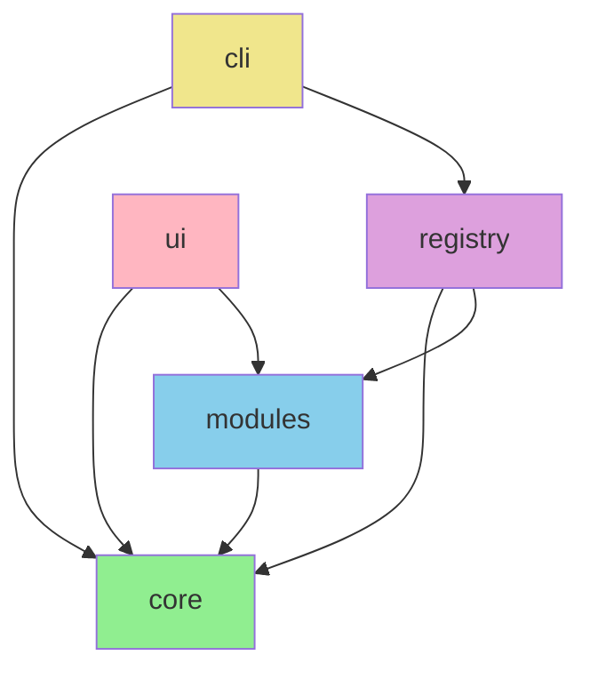

# Multi-Module Build Workflow - build-all-modules.yml

## Overview

The `build-all-modules.yml` workflow performs comprehensive multi-module builds with parallel execution strategy. It builds, tests, and validates all platform modules (core, modules, registry, cli, ui) across supported platforms and node versions.

**File**: `.github/workflows/build-all-modules.yml`  
**Trigger**: Push/PR on code/workflow changes  
**Duration**: 10-15 minutes  
**Runner**: ubuntu-latest  
**Parallelism**: 5 modules (matrix strategy)

---

## Table of Contents

1. [Workflow Purpose](#workflow-purpose)
2. [Module Architecture](#module-architecture)
3. [Build Matrix Strategy](#build-matrix-strategy)
4. [Job Workflow](#job-workflow)
5. [Caching Strategy](#caching-strategy)
6. [Build Process](#build-process)
7. [Testing Integration](#testing-integration)
8. [Artifact Handling](#artifact-handling)
9. [Performance Optimization](#performance-optimization)
10. [Troubleshooting](#troubleshooting)

---

## Workflow Purpose

**Goals**:
- ✅ Build all platform modules in parallel
- ✅ Validate build integrity across modules
- ✅ Run module-specific tests
- ✅ Generate coverage reports
- ✅ Upload build artifacts
- ✅ Report build status to PRs
- ✅ Support clean builds (no cache)

**Scope**: Node.js-based modules (JavaScript/TypeScript)

---

## Module Architecture

### Platform Modules

```
HELIOS Platform
├── core/                    # Core platform engine
│   ├── package.json
│   ├── src/
│   ├── tests/
│   └── dist/ (built)
├── modules/                 # Feature modules
│   ├── package.json
│   ├── src/
│   ├── tests/
│   └── dist/ (built)
├── registry/                # Module registry
│   ├── package.json
│   ├── src/
│   ├── tests/
│   └── dist/ (built)
├── cli/                     # Command-line interface
│   ├── package.json
│   ├── src/
│   ├── tests/
│   └── dist/ (built)
└── ui/                      # User interface
    ├── package.json
    ├── src/
    ├── tests/
    └── dist/ (built)
```

### Module Dependencies



**Build Order** (if sequential):
1. `core` (no dependencies)
2. `modules` (depends on core)
3. `registry` (depends on core, modules)
4. `cli` (depends on core, registry)
5. `ui` (depends on core, modules)

---

## Build Matrix Strategy

### Execution Strategy

```yaml
strategy:
  matrix:
    module:
      - core
      - modules
      - registry
      - cli
      - ui
  fail-fast: false
```

**Parallelization Benefits**:
- 5 modules build simultaneously
- Each module: ~2-3 minutes
- Sequential would take: ~10-15 minutes
- **Parallel reduces time by 80%**: ~2-3 minutes total

### Node.js Version

```yaml
steps:
  - name: Setup Node.js
    uses: actions/setup-node@v4
    with:
      node-version: 18          # LTS version
      cache: 'npm'              # Enable NPM caching
      cache-dependency-path: '${{ matrix.module }}/package-lock.json'
```

**Node.js 18 LTS**:
- Long-term support
- Stable and reliable
- Good npm package compatibility
- Security updates through April 2025

---

## Job Workflow

### Job 1: Setup Build Matrix

```yaml
setup:
  name: Setup Build Matrix
  runs-on: ubuntu-latest
  outputs:
    modules: ${{ steps.setup.outputs.modules }}
    node-version: ${{ steps.setup.outputs.node-version }}
  steps:
    - name: Checkout Repository
      # Prepare build configuration
    - name: Setup Build Configuration
      id: setup
      # Define modules and versions
```

**Purpose**: Centralize build configuration and emit outputs for dependent jobs

**Outputs**:
```json
{
  "modules": ["core", "modules", "registry", "cli", "ui"],
  "node-version": "18"
}
```

### Job 2: Build Modules (Matrix)

```yaml
build:
  name: Build ${{ matrix.module }}
  runs-on: ubuntu-latest
  needs: setup
  strategy:
    matrix:
      module: ${{ fromJson(needs.setup.outputs.modules) }}
    fail-fast: false
  steps:
    # Checkout
    # Setup Node
    # Cache
    # Install
    # Lint
    # Build
    # Test
    # Coverage
    # Upload artifacts
```

**Parallel Execution**:
```
Module 1 (core)      ┐
Module 2 (modules)   ├─ All execute simultaneously
Module 3 (registry)  ├─ (5 concurrent jobs)
Module 4 (cli)       ├─
Module 5 (ui)        ┘
                      └─ ~2-3 min total
```

### Job 3: Verify Build Integrity

```yaml
verify-builds:
  name: Verify Build Integrity
  runs-on: ubuntu-latest
  needs: build
  if: always()
  steps:
    - name: Download All Artifacts
      # Download all module artifacts
    - name: Verify Artifacts
      # Check artifact counts and sizes
    - name: Generate Build Report
      # Create summary report
```

**Verification**:
- ✅ All artifacts downloaded successfully
- ✅ Expected number of artifacts present
- ✅ No corrupted files
- ✅ File sizes within expected ranges

### Job 4: Report Status

```yaml
report-status:
  name: Report Build Status
  runs-on: ubuntu-latest
  needs: [build, verify-builds]
  if: always()
  steps:
    - name: Check Build Status
      # Determine overall status
    - name: Comment on PR
      # Post results to PR
```

---

## Caching Strategy

### NPM Cache

```yaml
- name: Setup Build Cache
  if: github.event.inputs.clean_build != 'true'
  uses: actions/cache@v3
  with:
    path: |
      ${{ matrix.module }}/node_modules
      ${{ matrix.module }}/dist
      ${{ matrix.module }}/build
    key: ${{ runner.os }}-${{ matrix.module }}-${{ hashFiles(format('{0}/package-lock.json', matrix.module)) }}
    restore-keys: |
      ${{ runner.os }}-${{ matrix.module }}-
```

**Cache Key Structure**:
```
linux-core-<hash-of-package-lock.json>
```

**Hit Scenarios**:
- ✅ `package-lock.json` unchanged → Cache hit
- ❌ `package-lock.json` changed → Cache miss (reinstall)

**Cache Contents**:
- `node_modules/` (~100-200 MB per module)
- `dist/` (build output)
- `build/` (build intermediate files)

### Cache Performance

| Scenario | Time | Notes |
|----------|------|-------|
| Cache hit | 30 sec | Restore + build only |
| Cache miss | 3-5 min | npm install + build |
| Clean build | 3-5 min | Force new install |

### Clear Cache

To force a clean build:
1. GitHub UI → Actions → Caches
2. Find cache by module name
3. Click "Delete" button
4. Or use workflow dispatch with `clean_build: true`

---

## Build Process

### Step 1: Checkout Repository

```yaml
- name: Checkout Repository
  uses: actions/checkout@v4
  with:
    fetch-depth: 0          # Full history for versioning
    submodules: true        # Include submodules if any
```

**Purpose**: Prepare code for building

### Step 2: Install Dependencies

```bash
cd ${{ matrix.module }}
npm ci --prefer-offline --no-audit
```

**Why `npm ci` instead of `npm install`**:
- Installs exact versions from `package-lock.json`
- Faster and more reliable
- Prevents dependency drift
- Best practice for CI/CD

### Step 3: Lint Code

```bash
cd ${{ matrix.module }}
if [ -f "package.json" ] && grep -q '"lint"' package.json; then
  npm run lint
else
  echo "No lint script found"
fi
```

**Typical lint checks**:
- ESLint (JavaScript/TypeScript)
- Code style validation
- Import sorting
- Unused variables

**Lint configuration**: `<module>/.eslintrc.json`

### Step 4: Build Module

```bash
cd ${{ matrix.module }}
if [ -f "package.json" ] && grep -q '"build"' package.json; then
  npm run build
else
  echo "No build script found"
fi
```

**Build output locations**:
- `dist/` - Production build
- `build/` - Intermediate files

**Typical build steps**:
- TypeScript compilation
- Bundling/webpack
- Asset optimization
- Generate type definitions

### Step 5: Run Tests

```bash
cd ${{ matrix.module }}
if [ -f "package.json" ] && grep -q '"test"' package.json; then
  npm test -- --coverage --passWithNoTests
else
  echo "No test script found"
fi
```

**Test framework options**:
- Jest
- Mocha
- Vitest
- Jasmine

**Coverage options**:
- `--coverage` - Generate coverage reports
- `--passWithNoTests` - Don't fail if no tests

---

## Testing Integration

### Test Execution

**Framework**: Jest (typical)

```bash
npm test -- \
  --coverage \
  --collectCoverageFrom='src/**/*.{js,ts}' \
  --passWithNoTests
```

**Output**:
```
 PASS  tests/core.test.ts
  ✓ should initialize platform
  ✓ should load modules
  ✓ should handle errors

Test Suites: 1 passed, 1 total
Tests:       3 passed, 3 total
Coverage:    85%
```

### Coverage Reports

Coverage reports stored in `coverage/` directory:

```
coverage/
├── lcov.info          # Coverage data format
├── lcov-report/       # HTML reports
│   └── index.html
├── coverage-summary.json
└── clover.xml         # Alternative format
```

**Coverage Thresholds** (example):
- Lines: 80%
- Functions: 80%
- Branches: 75%
- Statements: 80%

### Coverage Upload

```yaml
- name: Upload Coverage Reports
  if: always()
  uses: actions/upload-artifact@v3
  with:
    name: coverage-${{ matrix.module }}
    path: ${{ matrix.module }}/coverage/
    if-no-files-found: warn
    retention-days: 7
```

---

## Artifact Handling

### Build Artifacts

```yaml
- name: Upload Build Artifacts
  if: always()
  uses: actions/upload-artifact@v3
  with:
    name: build-artifacts-${{ matrix.module }}
    path: |
      ${{ matrix.module }}/dist/
      ${{ matrix.module }}/build/
    if-no-files-found: warn
    retention-days: 7
```

**Artifact structure**:
```
build-artifacts-core/
├── dist/
│   ├── index.js
│   ├── index.d.ts
│   ├── package.json
│   └── ...
└── build/
    └── ...
```

**Retention**: 7 days (automatically deleted)

### Artifact Access

**Download via GitHub UI**:
1. Go to workflow run
2. Scroll to "Artifacts"
3. Click module artifact
4. Download .zip file

**Download via CLI**:
```bash
gh run download <RUN_ID> -n build-artifacts-core
```

### Artifact Size Limits

- **Single artifact**: 5 GB maximum
- **Total per workflow**: 5 GB maximum
- **Typical module artifact**: 50-200 MB

---

## Performance Optimization

### Execution Time Breakdown

```
Setup:           2 min  (one-time)
│
├─ core:         2 min  (parallel with others)
├─ modules:      2 min
├─ registry:     3 min
├─ cli:          2 min
└─ ui:           3 min
     ↓
Verify:          1 min
Report:          1 min

Total (parallel): ~5 minutes
Total (sequential): ~15 minutes
Speedup: 3x
```

### Optimization Strategies

1. **Use npm cache**
   - Hit rate: ~90% (saves ~3 min per job)
   - Setup: Already configured

2. **Parallel builds**
   - 5 modules simultaneously
   - Already configured via matrix

3. **Skip unnecessary steps**
   ```bash
   if [ -f "package.json" ] && grep -q '"lint"' package.json; then
     npm run lint
   fi
   ```

4. **Shallow clone for speed**
   ```yaml
   fetch-depth: 0  # Full history for versioning
   ```

---

## Troubleshooting

### Build Failures

| Error | Cause | Solution |
|-------|-------|----------|
| `npm ERR! 404` | Package not found | Check package name spelling |
| `Module not found` | Missing dependency | Run `npm install` locally |
| `Lint errors` | Code style issue | Run `npm run lint` locally |
| `Test failure` | Test assertion failed | Fix test or code |

### Cache Issues

**Problem**: Cache not being restored

**Solutions**:
1. Check `package-lock.json` is committed
2. Clear cache in Actions tab
3. Verify cache key hasn't changed

### Timeout Issues

**Problem**: Job runs longer than expected

**Solutions**:
1. Check for network delays
2. Reduce test data size
3. Increase timeout limit
4. Optimize dependencies

### Artifact Upload Failures

**Problem**: Artifact upload times out or fails

**Solutions**:
1. Reduce artifact size
2. Compress before uploading
3. Remove unnecessary files
4. Check network stability

---

## Configuration Files

### package.json Scripts

```json
{
  "scripts": {
    "lint": "eslint src/",
    "build": "tsc --build",
    "test": "jest",
    "test:coverage": "jest --coverage",
    "ci": "npm run lint && npm run build && npm run test"
  }
}
```

### ESLint Configuration (.eslintrc.json)

```json
{
  "extends": ["eslint:recommended"],
  "parserOptions": {
    "ecmaVersion": 2021
  },
  "rules": {
    "no-unused-vars": "error",
    "no-console": "warn"
  }
}
```

### Jest Configuration (jest.config.js)

```javascript
module.exports = {
  preset: 'ts-jest',
  testEnvironment: 'node',
  collectCoverageFrom: ['src/**/*.ts'],
  coverageThreshold: {
    global: {
      lines: 80,
      functions: 80,
      branches: 75,
      statements: 80
    }
  }
};
```

---

## Best Practices

✅ **Do**:
- Use `npm ci` in CI/CD
- Keep `package-lock.json` committed
- Configure cache properly
- Set fail-fast appropriately
- Monitor build times
- Use matrix for parallelization

❌ **Don't**:
- Use `npm install` in CI
- Commit `node_modules`
- Disable caching
- Build with `latest` dependencies
- Ignore coverage reports
- Skip linting

---

## Advanced Topics

### Custom Build Steps

Add additional build steps in `package.json`:
```json
{
  "scripts": {
    "prebuild": "npm run clean",
    "build": "tsc",
    "postbuild": "npm run bundle"
  }
}
```

### Conditional Building

```bash
if [ "${{ github.event_name }}" == "pull_request" ]; then
  # PR-specific build
  npm run build:minimal
else
  # Full build for main/develop
  npm run build:full
fi
```

### Custom Reporting

Generate JSON report:
```javascript
// scripts/generate-build-report.js
const fs = require('fs');
const report = {
  timestamp: new Date().toISOString(),
  modules: [...],
  duration: process.uptime()
};
fs.writeFileSync('build-report.json', JSON.stringify(report, null, 2));
```

---

## References

- [npm Documentation](https://docs.npmjs.com/)
- [GitHub Actions Caching](https://docs.github.com/en/actions/using-workflows/caching-dependencies-to-speed-up-workflows)
- [Matrix Builds](https://docs.github.com/en/actions/using-jobs/using-a-build-matrix-for-your-jobs)
- [TypeScript Handbook](https://www.typescriptlang.org/docs/)
- [Jest Documentation](https://jestjs.io/docs/getting-started)

---

**Document Version**: 1.0  
**Last Updated**: 2024  
**Status**: Active ✅
